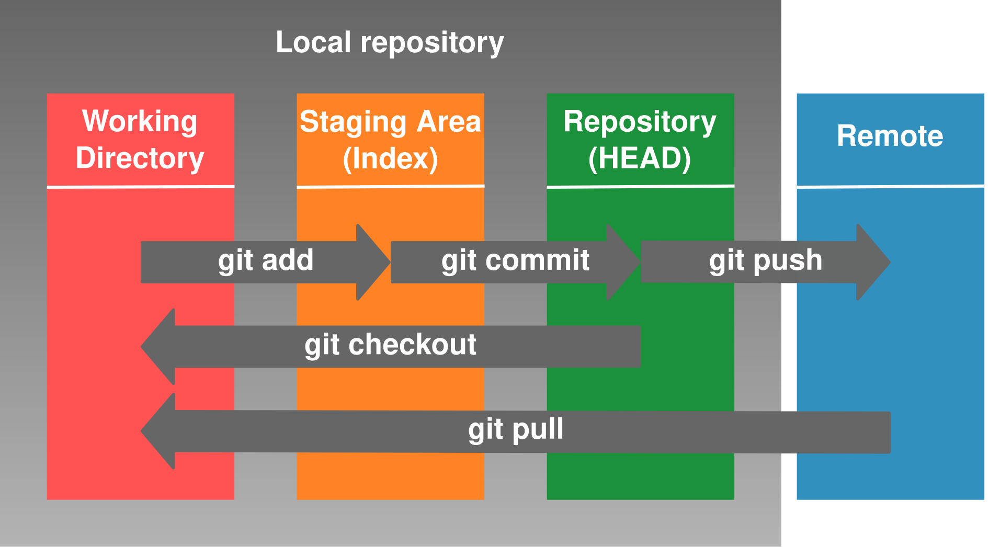

  # GIT INTRODUCTION
-----------------------------------------------------------------------------------------------
 Git is a distributed version control system that tracks changes in files and folders in a project over time. It allows multiple 
 developers to work on the same project simultaneously without interfering with each other's progress. Git is known for its efficiency, 
 flexibility, and robust support for branching and merging. 

 ### github and gitlab
  GitHub is a web-based platform used for storing and managing code, particularly for software development. It uses the version control      system Git, which allows multiple people to work on a project together efficiently by tracking changes and enabling collaboration. 

  ## working of git:
  
--------------------------------------------------------------------------------------------------------------------------------------
  ## commands in git:
    Before writing the commands to create the directory/folder for converting into git-repository.
    
     **1)git config --global user.name user_name**
      **git config --global user.email email_name **
         above command show who is the owner of the repository.

   **2) git init**- This command is used to convert folder into git repository
   **3) git status **-
   
    
